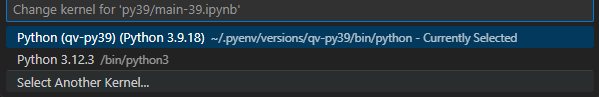
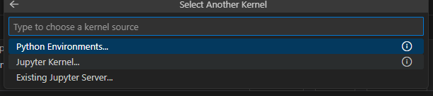

```bash
pyenv install 3.9.18
```

# setting

```bash
pyenv local qv-py39
```

```bash
pyenv activate qv-py39
pip install --upgrade pip
pip install jupyter ipykernel
```

```bash
python -m ipykernel install \
  --user \
  --name qv-py39 \
  --display-name "Python (qv-py39)"
```

# select kernal



- select Another Kernel... 선택



- jupyer kernal... 선택 


- 앞서 설정해둔 qv-py39 등의 가상환경 선택